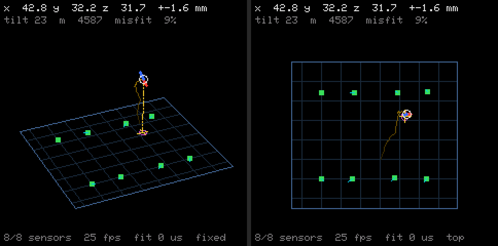
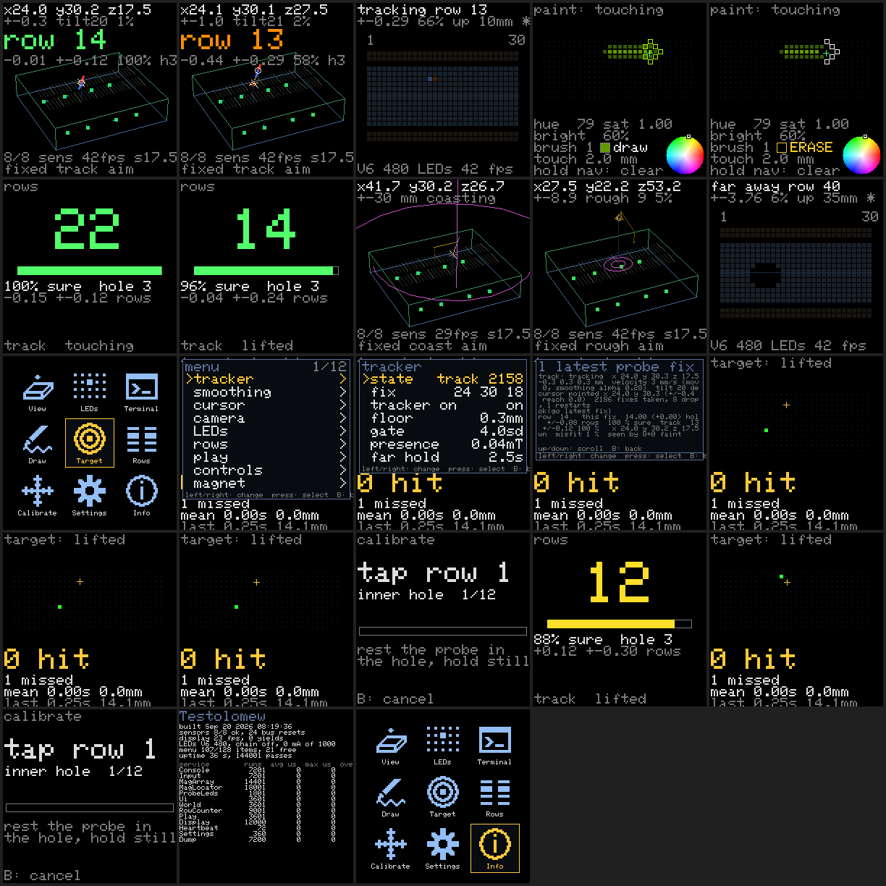

# Testolomew

The test bed for Jumperless V6 ideas: a [nanoCH32H417](https://github.com/wuxx/nanoCH32H417) dev board (WCH CH32H417, the coprocessor planned for V6), PlatformIO, and firmware laid out like [JumperlOS](https://github.com/Architeuthis-Flux/JumperlOS) so that whatever works here can be carried over.

First experiment: **locating a magnet in 3D with a 4×2 array of TMAG5273 Hall sensors**, as a way to track a cable-free probe, and showing it on the board's LCD.



*The LCD view (fixed camera and top-down) of the bench array, rendered on a PC from simulated noisy sensor readings through the real fit and drawing code. The purple ellipse under the magnet is the fix's own 2-σ error bar.*



*Every screen, rendered on the host by `tools/hostsim` (`make screens`): the View app with the probe on a row and lifted and aiming (the dotted line is where it points, the ring its error bar), the LEDs app (a spot on the aimed hole, an amber mark under the point), the Draw app painting and erasing with the brush ring, the LEDs with the brush, coasting through a 200 ms gap, a far probe as a rough "about here", Home, the Settings menu and a page, a Result panel over a page, the point-of-view camera, top-down, an orbited and panned view, the Terminal, Rows, Target, Calibrate, Info, and Home's nine cells.*

- `docs/wireless-probe-sensing.md` is everything learned so far about wireless probe sensing: the survey of methods, the numbers, the magnetometer design and its first-run checklist, and the CH32H417 toolchain notes.
- `docs/magnetometer-fusion-prior-art.md` is the prior-art study behind the tracker: the TMAG5273 datasheet read closely (registers, noise, timing, the CRC errata, what the driver should set), magnet tracking with sensor arrays and the estimators used, closed-form and far-field estimation, motion filtering, pointing, LED and on-screen display, and a recommended architecture.
- `docs/ratio-ladder-poc-spec.md` is the spec for the other prototype (capacitive ratio ladder on V5 hardware).

## Build and run

```sh
pio run                   # build
pio run -t upload         # flash with wlink through the board's own WCH-LinkE (its own USB-C port, not the chip's)
pio device monitor        # console: the WCH-LinkE's serial port, 115200
pio test -e native        # host-side tests (fit, tracker, row grid, LED cursor, menu and camera), no board needed
pio run -t compiledb      # compile_commands.json for clangd
```

The first build downloads the CH32 platform, the RISC-V toolchain and the CH32H4 Arduino core.

Three things that bite: editing `platformio.ini` changes the project checksum, and the next PlatformIO run - including the IDE extension's own background one - empties `.pio/build`, so if a flash is in progress it loses its ELF (copy the ELF elsewhere and flash that with `~/.platformio/packages/tool-wlink/wlink flash file.elf`). The WCH-LinkE can wedge so that `wlink flash` connects, erases, and then never acknowledges the first 4 KB write; a USB device reset clears it (pyusb with libusb: `dev = usb.core.find(idVendor=0x1a86, idProduct=0x8010); dev.reset()`). And `Error while fastprogram: [41, 01, 01, 05]`, after which the WCH-LinkE drops off USB for 20-40 s and comes back on its own: that one is the V3F. It has no instruction cache, fetches every instruction from the flash being programmed, and a page program with it running does not complete (the Arduino core's `ch32h4_park.c`); it hit every other flash once the sensor sampler ran on that core, and once left a half-written image that needed RESET held through the next flash. So before a flash the firmware must park the V3F: `pio run -t upload` sends the console command `F` first (`scripts/park_before_upload.py`), and flashing by hand with wlink you send `F` yourself (`python3 tools/readport.py <port> 1 /dev/null F`, then `wlink flash file.elf`; the reset after the flash brings both cores back). If a flash still fails: wait for `/dev/cu.usbmodem*` to return and flash again; if wlink answers `protocol error 0x55` to everything, hold RESET down while running the flash.

The board boots with its last zero: the array is zeroed once (`z`, with the probe away) and that zero is kept in flash, so a reboot with the probe lying on the board does not zero the magnet into the baseline (which made it invisible; every reflash during the first night did that). The console takes single-character commands; `?` lists them. With every module on:

| Key | |
|---|---|
| `?` | command list |
| `X` | service table (runs and timing per service) |
| `m` | magnetometer array status: addresses, part variants, latest fields |
| `z` | re-zero the ambient baseline (probe well away). The board never zeroes blind at boot: the saved zero is put back, or the compiled-in `MAG_ZERO_AT_BOOT` when none is saved |
| `p` | power-cycle and re-address every sensor |
| `i` | identify: print which sensor reads strongest |
| `b` | bus check: are there pull-ups on SCL/SDA, and what acknowledges with each sensor powered alone |
| `n` | LED strip statistics and the power line: the last frame's current by the model, the budget in force (the menu's "budget mA", never above the compiled-in ceiling `PROBELED_STRIP_HARD_MAX_MA`; a frame that would draw more is dimmed whole), then a dot runs up the chain |
| `F` | before a reflash by hand: stop the sampler and park the other core in ITCM (it would otherwise fetch the flash being written and the program would fail); nothing is read until the reset after the flash. `pio run -t upload` sends it itself |
| `f` | stream field frames as CSV |
| `l` | latest probe fix, with its own ± error bar in mm on each axis, and how many sensors see the magnet plainly + faintly |
| `k` / `K` | learn this magnet's strength and hold the fit to it (steadier height) / forget it |
| `t` | where the probe's point is: `t12⏎` = the magnet's centre is 12 mm up the shaft from the point. The magnet is magnetised along the shaft, so its pole direction is the shaft, and the point is that far down it (down = the lower end; a probe is not held upside down). `MAGLOC_TIP_OFFSET_MM` makes it permanent |
| `o` | orientation check: with a magnet held 1–2 cm over the array, which row order / rotation / board side explains it |
| `d` | stream probe fixes as CSV (the columns after `raw_z` are the tracker's: state, position, bar, cursor, gate distance, drops) |
| `u` | the cursor: straight under the tip, or where the tip points on the breadboard's surface (never past it, and never more than the reach cap from the tip) |
| `S` | the breadboard's surface height above the sensors: `S17⏎`. On the bench it is 17.5 mm; on V6 the surface is 7.1 mm above the base PCB (`MAGLOC_BOARD_Z_MM`); it is also learned: when the point bottoms out at the same height three seconds running, below the setting, the surface comes down to it (the scene draws the surface and shows its height as s<mm>) |
| `g` | the tracker on or off (off = every raw fix as it comes, for comparing) |
| `v` | next camera mode: fixed, sway, spin, top-down, follow (the target rides on the probe's point), POV (the camera is the probe, looking down its shaft) |
| `e` | next app (View, LEDs, Terminal, Draw, Target, Rows, Calibrate, Info), with each app's draw time; the Home grid (button A) picks one by name |
| `L` | stream the LED cursor for a V5 (one line per update, for `ports/jumperlos/ProbeCursor`) |
| `B` | LED layout: V6 (6+6 holes meeting at the centre, 16×30) or V5 (5+5 across the channel, JumperlOS's rails). With a V5 chain wired it stays V5 |
| `N` / `n` | the V5 LED chain (`PIN_LED_STRIP`) on or off / its frame statistics (frames, gaps between them, frames skipped because nothing changed) and then a dot that runs up the whole chain, rows 1–60 then the rails, so the wiring and the pixel order can be seen |
| `s` / `Z` | settings: what is saved for the next boot (every menu setting, the row anchors, the array's zero and the last good fix, kept in flash) / reset everything to its default now, anchors included, and save that (the menu's "reset settings" item is the same) |
| `Y` | the probe lay on the board while the array zeroed (it re-zeroes only when nothing is saved; `z` always): `Y0⏎` takes the last good fix's magnet back out of that zero, `Y1⏎` the reference fix in `MagLocator.h`. Only on a zero taken fresh with the probe in place - a saved or corrected one is refused |
| `y` / `w` / `W` | play mode `y1⏎` paint - which the Draw app switches on by itself and off when you leave it, the drawing kept for the next visit: the point paints the LED it touches; the joystick picks the colour on a wheel, its click toggles draw/erase, the nav stick's up/down set the brush's brightness and left/right its width (0-3 rows), its centre held clears; every value is on the screen and on the play menu page; the LED cursor is then the brush itself, a ring just outside what it would paint (a `+` round the one LED), no glow - `y2⏎` target (touch the green LED; the console says how long it took and how far off), `y0⏎` off / the tally and the paint's state / clear the paint |
| `r` | row mode (on at boot): which breadboard row the probe is over, Jumperless numbering (1–30 along the far half, 31–60 along the near half, 31 facing 1). The row large on the LCD, coloured by how sure the fix is, the breadboard drawn on the board; a line on the console twice a second (row, offset into it, hole 1–5 counted from the channel, ± in rows, % sure) |
| `h` | hold-still test: a second to settle, then 2 s of fixes → the row and hole, the scatter in rows and mm against the fit's own error bar, how many single fixes called that row, and how far it moved since the last test. Step one row, `h` again: it should say +1.00 |
| `c` | calibrate the rows: asks for twelve taps (rows 1, 15, 30, 60, 45, 31, each at the hole next to the channel and at the outermost hole) and fits the grid to them: where the breadboard lies, its angle, a scale each way and skew. A tap is the probe resting in the hole, still for a second (the hand settling) and then two more (the measurement), at the height the board holds the magnet at (learned from the first tap). The LCD shows which hole is wanted, a ring on it, and a bar that fills while the tap is taken. Prints what each tap still misses its hole by after the fit, which is the accuracy of the whole scheme in mm, and a `ROWCOUNT_GRID_AT_BOOT` line to paste into `RowCounter.h` to keep it. `c` again cancels |
| `R` | one more anchor by hand: `R30⏎` = "the probe is on row 30 now, in the hole next to the channel" (any row 1–60). Every anchor given is kept and the grid is fitted to all of them: one moves the breadboard into place, two or more 10 mm apart also give the angle and the scale |
| `C` | forget the anchors: back to the grid the firmware boots with |

### The controls, Home and the apps

V6 will have an ALPS RKJXM1015004 navigation stick (8-way with a centre push: four direction contacts A-D to `COM`, a diagonal closes two neighbours, and the push is a contact of its own on the footprint's `Push` pads - `docs/rkjxm1015004-catalog.png` has the drawing; `PIN_NAV_PRESS` reads it, and `src/ui/Input.h` explains how a push's wobble of the stick is kept from being a direction: with the push contact closed a direction has to hold 130 ms, longer than the wobble), an analog joystick with a press, and two buttons (pins in `BoardPins.h`). Each control is classified by `src/ui/ButtonTracker.h` the way JumperlOS's encoder button is: a **click** is the release of a press shorter than 500 ms, a **hold** fires at 500 ms and is never also a click, the direction keys **repeat** while held. The same controls can be typed on the console: **arrow keys** = the nav switch, **Enter** = its press (while something is open over the app), **Tab** = button A, **`** (backtick) = button B, **, .** = joystick left/right, **; '** = joystick up/down, **/** = the joystick's press - and the verbs `:key <control> [tap|down|up|hold]`, `:joy <x> <y>` and `:ui ...` drive them from a script.

The screen is an **app**, one of nine from the **Home** grid: **View** (the 3D scene), **LEDs**, **Terminal** (the log, 40 x 28), **Draw** (the paint app), **Target** (the target game), **Rows** (the counted row, large), **Calibrate** (the twelve taps), **Settings** and **Info**. The controls mean the same everywhere (`src/ui/UiShell.h` is the one owner of them): in an app, the nav stick, the joystick and their presses are the app's own; **A** clicked opens Home, held opens Settings; **B** clicked goes to the previous app (Home if there is none), held goes Home. On Home the stick moves and a press selects (on its way down, in every pane; the analog stick is a menu direction at a quarter of its travel; a tilt of the nav stick counts within a few tens of milliseconds - the **controls** page of Settings has the two guards and the deflection, and a `joystick: absolute` mode in which the stick's position is the cursor - point it at a Home cell or a menu row and press). Every Home icon carries its name. On a Settings page up/down move, **left/right change the value in place** (a toggle flips, a choice cycles, a number steps, faster after eight repeats), a press enters a page or runs an action, B backs a page and closes at the root, B held closes everything and opens Home; an action's output appears in a Result panel over the page (B dismisses it), the destructive ones ask first, and there is no edit mode to leave or cancel - the settings module writes a change two seconds after it stops. Twenty seconds without a touch closes whatever is open. A and B never reach an app, and a control still held when a pane closes is swallowed until it is released, so a held nav-left that backs out of the menu does not go on panning the camera. The probe, the LEDs and the paint carry on underneath whatever is open.

In **View** the nav stick pans, its press clicked steps the camera mode and held resets the view, the joystick orbits and zooms with its press held. In **Draw** the joystick moves the colour wheel's marker, its press clicked toggles draw/erase, nav up/down set the brush's brightness, left/right its width, the nav press held clears. In **Terminal** up/down scroll and the press jumps to the newest line. **Rows**' press turns row mode on, **Target**'s picks another target, **Calibrate**'s starts over. The Settings pages: **tracker**, **smoothing**, **cursor**, **camera**, **LEDs**, **rows**, **play**, **magnet**, **sensors**, **commands** (every console command as an action; one that asks for a number has it stepped in place first) and **reset settings**; `docs/knobs.md` section 2 lists every item. Everything the console prints goes to the serial port and into the log the Terminal and the Result panel show (`src/ui/UiStream.h`); every number, toggle and choice on the pages is saved to flash and back after a reboot, except the modes (row mode, the chain on/off, the V5 stream, the play mode).

`:screen` prints all of this as text (the app, the panes, the menu page with its items and values, the probe, the play state, the camera), `:screen:ascii` the picture as characters, and `python3 tools/screendump.py <port> out.png` grabs it as a PNG - which is how the UI is checked without a hand on the board; `tools/hostsim` runs the same firmware on a PC from a script (`make check`, `make screens`).

## Wiring

All in `src/board/BoardPins.h`. For the magnetometer array:

| | Pin |
|---|---|
| SCL / SDA | PA8 / PC9 (I2C3), **with external pull-ups to 3.3 V**; this chip has no internal ones for I²C |
| Sensor VCC 0–7 | PD0, PC10, PC11, PA14, PD6, PD2, PD3, PD4 |
| Sensor ground, set A / set B | PA15 / PD5 |

The sensors' supplies are GPIOs because a TMAG5273 forgets an assigned I²C address whenever it loses power: they have to be powered up one at a time and re-addressed at every boot. `src/magarray/MagArray.h` explains the sequence. The array's geometry (pitch, order, each sensor's rotation) is `src/magarray/MagArrayConfig.h`; the default 20 mm pitch is a placeholder to be measured.

The LCD is whatever ST7789 panel is on the board's 12-pin FPC connector; `src/display/ST7789.h` has the numbers for the common ones (default 1.54" 240×240).

A V5's breadboard LEDs can be driven straight from the bench: its LED data-in to `PIN_LED_STRIP` (PD7, SPI1's MOSI; the WS2812 bit stream is made of SPI bytes over DMA, `src/probeled/LedStrip.h`), grounds shared. The frame is the 300 hole LEDs and then the 100 rail LEDs in JumperlOS's order. On a V5 whose rails are a strip of their own (the r8 main board: solder jumper JP20 feeds `LED_RAILS_IN` from the RP2350's second data line, not from the end of the breadboard chain) the rails need a second wire to `PIN_LED_STRIP_TOP` (PC12 or PA13, SPI3's MOSI, with PB3/PB4 taken as its clock and MISO). The strip's data line couples into the sensor bus if the two run together: keep it away from the SCL/SDA wires (the sensor read is written to shrug off a glitch, `src/magarray/TMAG5273.cpp`, but not to like it). The chain's current is kept under the menu's "max mA" (600 to start, by a model of 8 mA per colour at full - an assumption for the V5's 1010-package LEDs): a frame that would draw more is scaled down whole, because a V5's 5 V rail browned out under a wide glow at full brightness (JumperlOS itself runs the LEDs at 10/255).

## Layout

```
src/
  main.cpp          setup() begins each module and registers its Service; loop() is the scheduler
  config.h          which modules are in the build
  jos/              Service + jOSmanager: JumperlOS's scheduler interface, cut down
  board/            every pin, and board-level helpers
  console/          single-character serial commands; modules register their own
  common/           Vec3
  magarray/         TMAG5273 driver; MagSampler (the I2C round-robin on the other core, the V3F, into shared RAM);
                    MagArray service (addressing, decoding the sampler's bytes into 100 Hz frames, the zero)
  magfit/           MagFit (pure-math dipole fit + lattice search, host-testable); MagTracker (Kalman track, gating, coasting,
                    the cursor on the surface, 1-Euro filter; host-testable); MagLocator service (fit -> tracker, baseline check)
  display/          ST7789 framebuffer push (DMA, two bands); FastDraw (text, lines and rectangles straight into the
                    canvas: GFX's own are 60x slower here); MagView service (the 3D scene, the LED preview, the log screen)
  rowcount/         RowGrid (pure math: position -> breadboard row 1-60 and hole, host-testable); RowCounter service
  probeled/         ProbeLeds (pure math: the cursor as a soft spot on a coordinate-indexed LED table, V6 and V5 layouts,
                    the looks - colour schemes, bloom, sparkle, pulse, touch ring - host-testable); LedStrip (WS2812 over
                    SPI + DMA, one per chain); ProbeLedService (renders and sends at 50 Hz, ahead of the display)
  ui/               Input (nav switch, joystick, buttons; console key emulation), Menu (pure logic, host-testable),
                    Camera (pure math, host-testable), UiStream (console tee + log), Ui service (bindings, menu, drawing)
  settings/         Settings service: every menu setting, the row anchors, the array's zero and the last good fix as text in
                    the flash tail (the core's EEPROM library), put back at boot, written 2 s after a change settles; "reset
                    settings" in the menu (Z) puts everything back to its default. Modes (row mode, the chain, the V5 stream,
                    play) are not saved: the board boots in row mode, quiet
  play/             Play service: paint the LEDs with the point (the draw screen shows the drawing as the LEDs have it), a target game with a tally
  console/          ...and SerialDma: the console's transmit by DMA, so a print never holds the loop
test/               host tests: test_magfit, test_magtracker, test_rowgrid, test_probeleds, test_ui
tools/              magcal (array self-calibration from a recording), gridfit (refit the row grid to an anchors file),
                    readport.py (timestamped console capture with keys sent), hostsim/ (the whole firmware on a PC:
                    screenshots of every screen, and a ten-minute soak), and the recordings
ports/jumperlos/    ProbeCursor: the JumperlOS module for a V5 (compile-checked against JumperlOS, not yet run on one)
attic/              things tried and dropped, out of the build (the two-magnet probe fit, the gradient-tensor far-field estimate)
scripts/            src_subdirs_include.py, same as JumperlOS: every folder under src/ is on the include path
docs/
```

Conventions are JumperlOS's: Arduino framework, feature folders under `src/` with bare `#include "Foo.h"`, a module is one or more `Service` subclasses with a `getInstance()` singleton and an `extern` reference, `.clang-format` copied from JumperlOS (LLVM base, 4 spaces, no column limit), plain structs and free functions for drivers, no templates or exceptions. `src/jos/JumperlOS.h` deliberately has the same file name and the same `Service` interface as JumperlOS, so a module's scheduling code moves over unchanged. The one class that derives from anything but `Service` is `UiStream` (a `Stream`, so the console can print through it); JumperlOS has the same thing in Jerial.

## Calibrating the array

`tools/magcal.cpp` works out where each sensor really is, how it is turned, and its gain, from a recording of a magnet being waved over the array: stream frames with `f`, save them to a file, measure one real distance (sensor 4 to sensor 7) for scale, and

```sh
cd tools
c++ -std=c++11 -O2 -I../src/magfit -I../src/common magcal.cpp ../src/magfit/MagFit.cpp -o magcal
./magcal recordings/my-recording.txt 53.4 100     # 53.4 = mm from sensor 4 to 7; frames after 100 s are held back as a test
```

Copy the table it prints into `src/magarray/MagArrayConfig.h` (and into `magcal.cpp`'s own copy, which must match the firmware the recording was made with). `tools/recordings/` has the recording the current table came from and the ruler test that checked it. Before calibrating, `i` (sensor order) and `o` (rotation, side, row order) get the table close enough for the solver to converge.

The row grid the firmware boots with (`ROWCOUNT_GRID_AT_BOOT`) came from `tools/gridfit.cpp`: a file of `row hole x y z sigmaMm` lines (one per known hole, from a stepping run like `tools/recordings/2026-09-17-row-stepping-anchors.txt`), built with `c++ -std=c++11 -O2 -I../src/rowcount -I../src/common gridfit.cpp ../src/rowcount/RowGrid.cpp -o gridfit`, prints the fit, the define to paste, and every anchor's miss. `tools/readport.py <port> <seconds> <outfile> [keys]` captures the console with a timestamp per line and sends the keys first (only one program may have the port open, so close the monitor). `tools/fixstats.py <capture>...` gives a `d` stream's rest statistics (robust and plain jitter of the raw fix, the track and the cursor, axis wander, misfit, fit time); `tools/recordings/2026-09-1[89]-night-*.txt` are the night of 2026-09-18's before and after, and `docs/morning-report-2026-09-19.md` reads them. `docs/knobs.md` is the reference card: every menu item and console command, what it does and its default, and every compile-time knob touched in the night and morning of 2026-09-18/19 with its reason. `tools/hostsim/` runs the whole firmware on a PC (its README has the build lines).

## Adding a module

1. Make a folder under `src/` and write a `Service` in it. `src/magfit/MagLocator.*` is the smallest complete example: `begin()`, `service()`, `getName()`, `getPriority()`, `periodUs()`.
2. Take pins from `BoardPins.h` (add them there), not from literals.
3. Register console commands from the module's own `begin()` with `consoleAddCommand()`.
4. Add a `MODULE_…` flag to `src/config.h` and a three-line block to `setup()` in `src/main.cpp`.

Removing one is the reverse. Setting its flag to 0 stops it being started or scheduled; its files still compile, so a switched-off experiment cannot quietly rot.

Both cores are available through the Arduino core (`setup1()`/`loop1()` run on the 100 MHz V3F, like arduino-pico's second core). The sensor round-robin (`src/magarray/MagSampler`) runs on the V3F; everything else on the 400 MHz V5F. The V3F has no instruction cache: code it runs in a tight loop belongs in ITCM (`__itcm_func`, which it reaches in 2 HCLK cycles; flash is a ~25 MHz equivalent to it), and its `micros()` has no sub-millisecond part.

## Toolchain

`platform-ch32v` (pinned commit) with the `ArduinoCore-CH32H4` Arduino core, board `ch32h417qeu6_evt_r0` (WCH's EVT board, same chip). The core raises the chip's VIO18 I/O rail from its 1.2 V reset value to 3.3 V at boot, which almost every pin on this board depends on. `docs/wireless-probe-sensing.md` §7 has the notes on the alternatives that were looked at (WCH's SDK via `noneos-sdk`, ch32fun).
